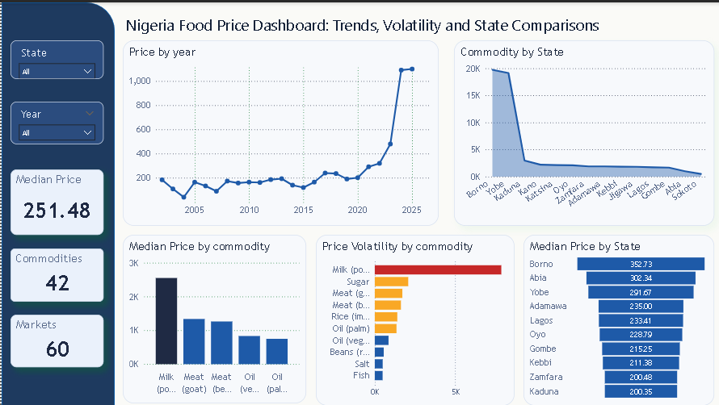

# Nigeria Food Price Analysis Dashboard 

## The Problem
Food prices in Nigeria have been changing quickly. I wanted to see which states are most expensive and which foods (like Milk or Meat) are rising the fastest.

## The Challenge: Messy Units
The raw data from Kaggle was "dirty." 
* **The Problem:** Units were inconsistent (e.g., some prices were per 'kg', others per 'bag' or 'liter').
* **The Solution:** I used **Python (Pandas)** to standardize these units so that the "Median Price" comparison would be fair and accurate.

## The Dashboard

## Key Findings 
* **Price Spike:** Prices stayed flat for years but jumped massively after 2020.
* **Top Spender:** Borno State has the highest median food prices (352.73).
* **Most Volatile:** Milk powder prices change the most frequently compared to other items.

## Tools I Used
* **Data Cleaning:** Python
* **Visualization:** Power BI
